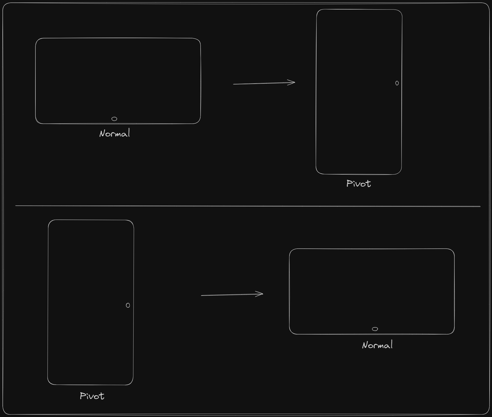

# QuickPivot
Quickly brings the main screen to pivot view in Windows. ( Screen Orientation )
## Usage
If golang is installed, you can use the following command to install it.
```
git clone https://github.com/coderantidote/quickpivot.git
cd quickpivot
go run main.go 
[or] 
go build main.go
```
## Release
You can download the latest release from [here](https://github.com/coderantidote/quickpivot/releases).
## Screenshot


## References

[https://github.com/Clicketyclick/ChangeScreenOrientation](https://github.com/Clicketyclick/ChangeScreenOrientation) ( Powershell Version )
### Windows API
[EnumDisplaySettingsW](https://docs.microsoft.com/en-us/windows/win32/api/winuser/nf-winuser-enumdisplaysettingsw)

[ChangeDisplaySettingsW](https://docs.microsoft.com/en-us/windows/win32/api/winuser/nf-winuser-changedisplaysettingsw)